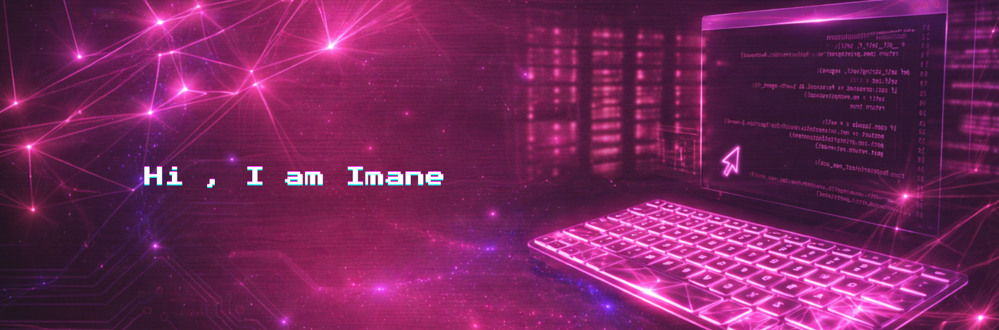

  
 
  
  
 
    
  

 
  

    
    &nbsp;
    
   
   
 
    <!--

   -->
    

---
  

<h2>✨ About ✨ </h2>
 

I am a Full-Stack Developer passionate about creating elegant, modern and user-friendly web experiences.I'm a technology enthusiast. I consider myself a curious individual, always eager to learn new things.

&nbsp;

&nbsp;

&nbsp;

 

---

  
<h2>✨ GitHub Snapshot ✨ </h2>
  
 

  

  

---

<!-- Technical Skills -->

<h2 align="center">✨ Tech Stack ✨</h2>

 
   
   
   
   
    
   
 

---

## ✨ Developer Mindset ✨

  
<bold>"Great development is built with clean code, thoughtful design, and continuous learning."</bold>

 
  
    
       

   
| 🌸 Principle | 💡 How I Apply It |
|:---:|:---|
|  Clean Code | Readable, maintainable & SOLID principles |
|  User First | Design for humans, not machines |
|  Never Stop | Learn something new every single day |
|  Ship It | Done is better than perfect |
|  Collaborate | Great things are built together |
 

 

---

<h2 align="center">✨ Tools ✨</h2>

  
  
  
  
  
  
  

---

✨ *Always learning. Always building. Always improving* ✨

